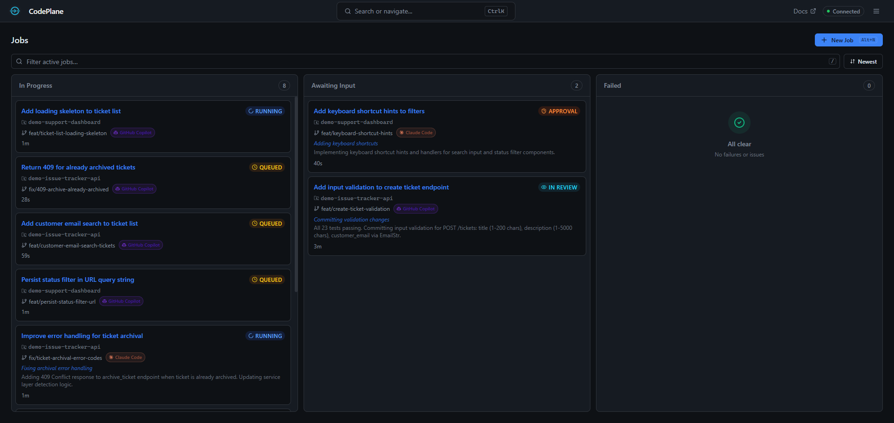

<p align="center">
  
</p>

<h1 align="center">CodePlane</h1>

<p align="center">
  <strong>A control plane for coding agents, your browser is the cockpit</strong>
</p>

<p align="center">
  
  
  <a href="https://github.com/dfinson/codeplane/actions/workflows/ci.yml"></a>
  <a href="https://codecov.io/gh/dfinson/codeplane"></a>
  
</p>

---

> **Pre-alpha** — Under active development. Not yet usable.

CodePlane orchestrates coding agents headless on your workstation — no IDE, no terminal session. Start work, supervise from any device, and decide what gets merged — on your schedule.

<p align="center"></p>

## Quick Start

> Requires Python 3.11+ and Git. You also need at least one agent CLI installed and authenticated: [GitHub Copilot CLI](https://docs.github.com/en/copilot/managing-copilot/configure-personal-settings/using-github-copilot-in-the-cli) or [Claude Code CLI](https://docs.anthropic.com/en/docs/claude-code).

```bash
pip install codeplane
cpl up                        # start server on localhost:8080
```

Open `http://localhost:8080`, register a repository in Settings, and create your first job.

## What It Does

- **Headless** — Runs as a standalone server, no editor session required. Start a task and close your laptop
- **Remote & mobile** — Pick up from your phone via Dev Tunnels or Cloudflare Tunnels — approve, review, and steer from anywhere
- **Deep visibility** — Watch agent reasoning, tool calls, plan progress, diffs, and costs streaming in real time — not a summary after the fact
- **Approval gates** — Risky operations (file writes, shell commands) pause for your review
- **Diff review & merge** — Syntax-highlighted diffs, workspace browsing, merge/PR/discard controls
- **Cost analytics** — Track token usage, costs, and model performance across all jobs
- **Multi-agent** — Works with GitHub Copilot CLI and Claude Code CLI
- **MCP server** — Expose CodePlane as tools for agent-to-agent orchestration

## CLI

```bash
cpl up                                       # start server
cpl up --remote                              # enable Dev Tunnels for remote access
cpl up --remote --provider cloudflare        # use Cloudflare Tunnel
cpl up --port 9090                           # custom port
cpl down                                     # stop server
cpl restart                                  # stop and restart
cpl setup                                    # interactive first-time setup
cpl doctor                                   # diagnose environment issues
cpl info                                     # show connection details and QR code
cpl version                                  # show version
```

## Documentation

Full docs: [dfinson.github.io/codeplane](https://dfinson.github.io/codeplane)

## Contributing

See [CONTRIBUTING.md](CONTRIBUTING.md) for development setup, testing, and conventions.

## License

[MIT](LICENSE)
