<p align="center">
  
</p>

<h1 align="center">CodePlane</h1>

<p align="center">
  <strong>Local repository control plane for AI coding agents</strong>
</p>

<p align="center">
  
  
  <a href="https://codecov.io/gh/dfinson/codeplane"></a>
  
</p>

---

## The Problem

AI coding agents lose **5-10x time** on tasks that should be instant:

- **Exploratory thrash** — repeated grep, file opens, and retries to build a mental model
- **Terminal mediation** — deterministic operations (git status, diff, run test) produce unstructured text and loops
- **Missing deterministic refactors** — renames that IDEs do in seconds take agents minutes via search-and-edit

The bottleneck is I/O and orchestration, not model capability.

## The Solution

CodePlane turns a repository into a **deterministic, queryable system**:

```
Agent plans and decides → CodePlane executes → Structured result → Next action
```

Every operation returns complete, structured context in a single call. No probing. No guesswork.

```mermaid
flowchart LR
    subgraph Agent["AI Coding Agent"]
        A1[Plan]
        A2[Decide]
    end
    
    subgraph CodePlane["CodePlane Server"]
        direction TB
        T0["Tier 0: Lexical Index<br/>(Tantivy)"]
        T1["Tier 1: Structural Facts<br/>(Tree-sitter + SQLite)"]
        OPS["Git · Files · Refactor · Tests"]
    end
    
    subgraph Output["Structured Results"]
        R1[Bounded candidate sets]
        R2[Patch previews]
        R3[Coverage manifests]
    end
    
    Agent -->|MCP Tools| CodePlane
    CodePlane --> Output
    Output -->|Single call| Agent
```



## Status

🚧 **Pre-alpha** — Core infrastructure (M0) and Git operations (M1) complete. Index engine (M2) in progress.

| Phase | Milestone | Status |
|-------|-----------|--------|
| **Foundation** | M0: Core (types, errors, logging, config) | ✅ |
| | M1: Git Operations (status, staging, commits, branches, diffs) | ✅ |
| **Index** | M2: Index Engine (Tantivy lexical + Tree-sitter structural) | 🚧 |
| **Execution** | M3: Refactor Planner · M4: Mutation Engine · M5: Ledger | |
| **Interface** | M6: Daemon & CLI · M7: MCP Tools · M8: Test Runner | |
| **Release** | M9: Polish & Hardening | |
| **Research** | M10: Advanced Semantic Support (SCIP/LSP analysis) | 🔬 |

Track progress: [GitHub Milestones](https://github.com/dfinson/codeplane/milestones)

## Quick Start

```bash
make dev         # Install with dev deps
make test        # Run tests
make lint        # Ruff
make typecheck   # Mypy
```

## Design Authority

[SPEC.md](SPEC.md) is the single source of truth. Key sections:

- §7: Index Architecture (Tier 0 + Tier 1)
- §19: Semantic Support Exploration (design archaeology)

## License

[MIT](LICENSE)
