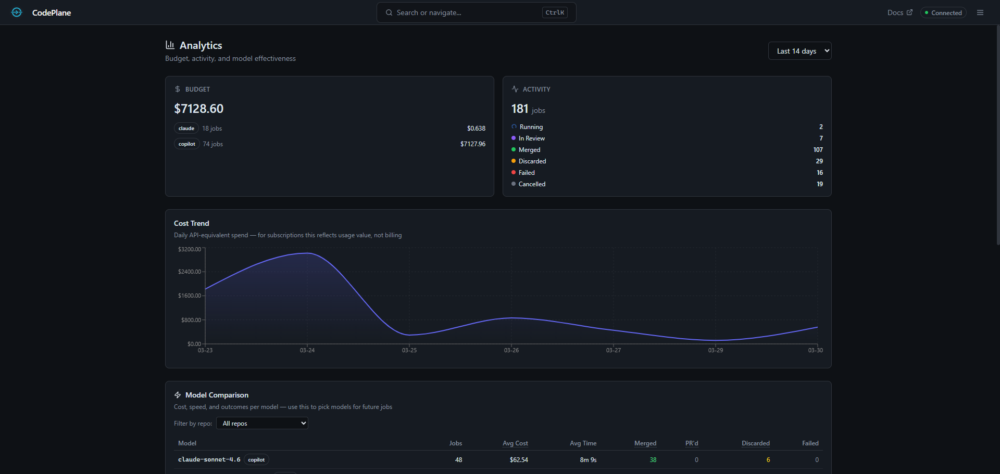

# Analytics

CodePlane includes a built-in analytics dashboard for tracking costs, token usage, model performance, and tool health across all your jobs.

## Opening Analytics

Press `Alt+A` or open the hamburger menu and select **Analytics**.

<div class="screenshot-desktop" markdown>

</div>

## Dashboard Sections

### Overview Cards

Six key metrics at a glance:

- **Total Cost** — Aggregate spend across all jobs in the selected period
- **Total Tokens** — Input + output token consumption
- **Avg Duration** — Mean job execution time
- **Tool Calls** — Total tool invocations with success rate
- **Cache Hit Rate** — How effectively the context cache is being used
- **Premium Requests** — Copilot premium request consumption

### Cost Trend

A line chart showing daily cost and job count over the selected period. Spot spending spikes and correlate with job volume.

### Job Status Distribution

Pie chart breaking down jobs by outcome: succeeded, failed, cancelled, running.

### Model Breakdown

Top models by cost, showing:

- Cost per model
- Input/output token split
- Number of jobs using each model

### Tool Health

Tool call statistics including:

- Success rate per tool
- Failure counts
- Latency percentiles (p50, p95, p99)

### Repository Breakdown

Top repositories by cost, helping identify which repos consume the most resources.

### Jobs Table

Sortable, filterable table of individual jobs with telemetry data:

- Filter by SDK, model, status, or repository
- Sort by cost, duration, tokens, or date
- Paginated for large job histories

## Time Period

Use the period selector to view analytics for the last 1–365 days (default: 7 days).

## OTEL Export

CodePlane uses OpenTelemetry internally. To push metrics and traces to an external collector (Grafana, Jaeger, Prometheus):

```bash
export OTEL_EXPORTER_ENDPOINT=http://localhost:4317
cpl up
```

This enables OTLP export alongside the built-in in-memory metrics.
