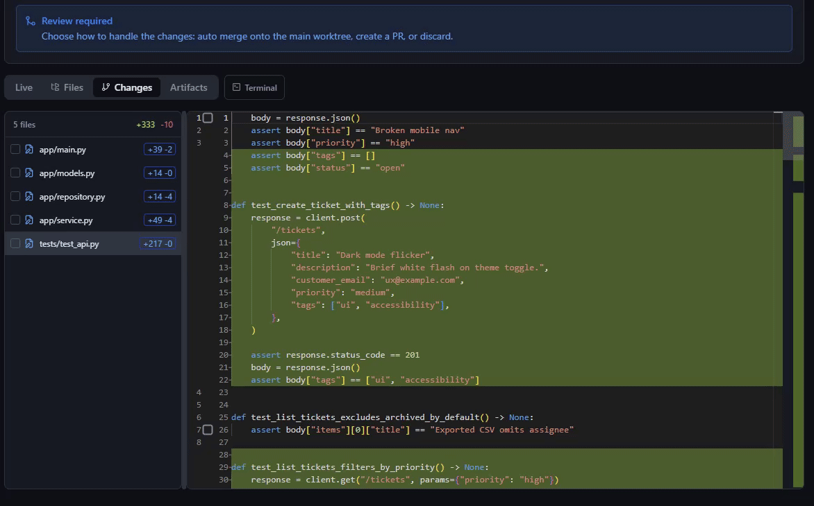

---
hide:
  - navigation
---

# Quick Start

Get CodePlane running and complete your first supervised agent job. No editor required — just a terminal and a browser.

## Prerequisites

| Requirement | Details |
|-------------|---------|
| **Python** | 3.11 or later |
| **Git** | Any recent version |
| **Agent CLI** | At least one installed and authenticated: [GitHub Copilot CLI](https://docs.github.com/en/copilot/managing-copilot/configure-personal-settings/using-github-copilot-in-the-cli) or [Claude Code CLI](https://docs.anthropic.com/en/docs/claude-code) |

You also need a **local Git repository** to run jobs against.

## Install

```bash
pip install codeplane
```

Verify the installation:

```bash
cpl doctor
```

This checks that Python, Git, and your agent CLIs are installed and authenticated.

## Start the Server

```bash
cpl up
```

Open `http://localhost:8080` in your browser.

For remote access (phone, tablet, another machine):

```bash
cpl up --remote                    # auto-generates a password
cpl info                           # prints URL + QR code
```

A password is always required for remote access — one is generated automatically unless you set it with `--password` or the `CPL_DEVTUNNEL_PASSWORD` env var. See [Configuration > Remote Access](configuration.md#remote-access) for Cloudflare Tunnels and other options.

!!! tip "First-time setup"
    The first time `cpl up` is run, `cpl setup` will be triggered automatically — it walks you through registering your first repository and setting preferences.

## Register a Repository

Go to **Settings** (`Ctrl+,`) and add a local Git repository path. This tells CodePlane which codebases it can work against.

## Create Your First Job

1. Press `Alt+N` or click **New Job**
2. Write a prompt — e.g., *"Add input validation to the user registration endpoint"*
3. Select the repository, agent CLI, and model
4. Click **Create Job**

The agent starts working in an isolated Git worktree. Your working directory is never modified.

## Watch It Run

The job detail view shows live updates:

- **Transcript** — the agent's reasoning and tool calls
- **Plan** — the agent's planned steps and progress
- **Logs** — structured output with level filtering
- **Metrics** — token usage and estimated cost

<div class="screenshot-desktop" markdown>

</div>

## Handle Approvals

Whether the agent pauses for approval depends on the **permission mode**:

| Mode | Behavior |
|------|----------|
| `full_auto` | Everything is auto-approved — no prompts (default) |
| `review_and_approve` | Reads are auto-approved; file writes, shell commands, and network access pause for your approval |
| `observe_only` | Reads only — all writes and mutations are blocked |

You can set the mode per-job, per-repo (`.codeplane.yml`), or globally — see [Configuration](configuration.md).

When an approval prompt appears, choose:

- **Approve** — allow this action
- **Reject** — block it; the agent may try an alternative
- **Trust Session** — auto-approve all remaining actions for this job

## Review & Merge

When the agent finishes, review the diff:

<div class="screenshot-desktop" markdown>

</div>

Then resolve the job:

| Option | What it does |
|--------|-------------|
| **Merge** | Merge the worktree branch into your base branch |
| **Smart Merge** | Cherry-pick only the agent's commits (skips setup noise) |
| **Create PR** | Push the branch and open a pull request |
| **Discard** | Delete the worktree and discard all changes |

## Remote Access

Access CodePlane from your phone or any other device:

```bash
cpl up --remote                              # Dev Tunnels (default)
cpl up --remote --provider cloudflare        # Cloudflare Tunnels
```

The UI is fully responsive — monitor jobs, approve actions, and send messages from anywhere.

## What's Next

- [Usage Guide](guide.md) — the full workflow in detail
- [Configuration](configuration.md) — permission modes, remote access, tunnels
- [CLI Reference](reference/cli.md) — all `cpl` commands
